<!doctype html>
<html lang="en">

<head>
    <!-- Required meta tags -->
    <meta charset="utf-8">
    <meta name="viewport" content="width=device-width, initial-scale=1">
    <link href="https://cdn.jsdelivr.net/npm/bootstrap@5.1.3/dist/css/bootstrap.min.css" rel="stylesheet"
        integrity="sha384-1BmE4kWBq78iYhFldvKuhfTAU6auU8tT94WrHftjDbrCEXSU1oBoqyl2QvZ6jIW3" crossorigin="anonymous">
    <!-- Meu css-->
    <link rel="stylesheet" href="css/estilo.css">
    <link rel="stylesheet" href="css/galeria.css">

    <title>Hotel Pet</title>
</head>

<body>
    <!-- Cabeçalho -->
    <header class="p-3 bg-laranja text-white d-flex">
        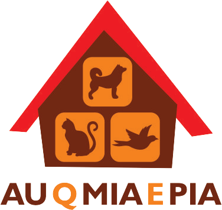

        <h3 class="titulo">Hotel e creche para pets!</h3>
    </header>
    <!-- Barra de navegação -->
    <nav class="navbar navbar-expand-lg navbar-dark bg-navbar">
        

            <!-- Botão Hamburguer -->
            <button class="navbar-toggler" type="button" data-bs-toggle="collapse" data-bs-target="#menu1"
                aria-controls="menu1" aria-expanded="false" aria-label="Toggle navigation">
                
            </button>

            

                <ul class="navbar-nav me-auto mb-2 mb-lg-0">
                    <li class="nav-item">
                        <a class="nav-link active" href="home.html">Home</a>
                    </li>
                    <li class="nav-item">
                        <a class="nav-link active" href="galeria.html">Galeria</a>
                    </li>
                    <li class="nav-item">
                        <a class="nav-link active" href="forms.html">Reservas</a>
                    </li>

                    <li class="nav-item">
                        <a class="nav-link active" href="quemsomos.html">Quem Somos</a>
                    </li>

                </ul>
            

        

    </nav>
    <!-- Fim menu e navbar -->

    

        

            <!--criando coluna da esquerda com espaço de 8 col-->
            

                

                    

                        <h2><i> Ambiente</i></h2>
                    

                    

                        Aqui na Auqmiaepia contamos com um local amplo e aconchegante para seu pet brincar e se divertir
                        bastante, com conforto e segurança.
                        Com vários briquedos, jogos e atividades lúdicas faz com que o Auqmiaepia seja
                        o lugar ideal para deixar o seu amigo.
                    

                    

                        

                            <button type="button" data-bs-target="#carouselExampleCaptions" data-bs-slide-to="0"
                                class="active" aria-current="true" aria-label="Slide 1"></button>
                            <button type="button" data-bs-target="#carouselExampleCaptions" data-bs-slide-to="1"
                                aria-label="Slide 2"></button>
                            <button type="button" data-bs-target="#carouselExampleCaptions" data-bs-slide-to="2"
                                aria-label="Slide 3"></button>
                            <button type="button" data-bs-target="#carouselExampleCaptions" data-bs-slide-to="3"
                                aria-label="Slide 4"></button>
                            <button type="button" data-bs-target="#carouselExampleCaptions" data-bs-slide-to="4"
                                aria-label="Slide 5"></button>
                            <button type="button" data-bs-target="#carouselExampleCaptions" data-bs-slide-to="5"
                                aria-label="Slide 6"></button>
                            <button type="button" data-bs-target="#carouselExampleCaptions" data-bs-slide-to="6"
                                aria-label="Slide 7"></button>
                        

                        

                            

                                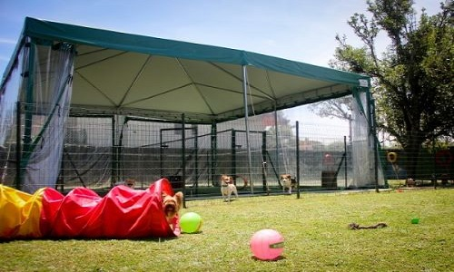
                                

                                

                            

                            

                                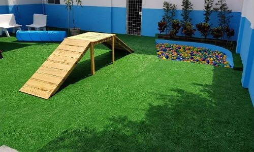
                                

                                

                            

                            

                                
                                

                                

                            

                            

                                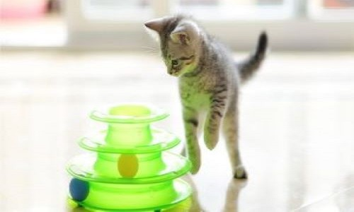
                                

                                

                            

                            

                                
                                

                                

                            

                            

                                
                                

                                

                            

                            

                                
                                

                                

                            

                        

                        <button class="carousel-control-prev" type="button" data-bs-target="#carouselExampleCaptions"
                            data-bs-slide="prev">
                            
                            Previous
                        </button>
                        <button class="carousel-control-next" type="button" data-bs-target="#carouselExampleCaptions"
                            data-bs-slide="next">
                            
                            Next
                        </button>
                    

                

                

                    

                        <h2><i> Locais de Brincadeiras</i></h2>
                    

                    

                        Nosso hotel oferece aos pets locais ideais para o seu divertimento, de acordo com a necessidade
                        de
                        cada um. Dessa maneira, além da segurança oferecida nesses locais temos também nossa equipe de
                        funcionários que monitoriam tudo o que acontece.
                    

                    

                        Nosso hotel conta com:
                    

                    <ul>
                        <li>
                            
Piscina

                        </li>
                        <li>
                            
Piscina de bolinha

                        </li>
                        <li>
                            
Ambiente especial para gatos

                        </li>
                        <li>
                            
Parquinho

                        </li>
                    </ul>
                    

                        

                            <button type="button" data-bs-target="#carouselExampleCaptions" data-bs-slide-to="0"
                                class="active" aria-current="true" aria-label="Slide 1"></button>
                            <button type="button" data-bs-target="#carouselExampleCaptions" data-bs-slide-to="1"
                                aria-label="Slide 2"></button>
                            <button type="button" data-bs-target="#carouselExampleCaptions" data-bs-slide-to="2"
                                aria-label="Slide 3"></button>
                            <button type="button" data-bs-target="#carouselExampleCaptions" data-bs-slide-to="3"
                                aria-label="Slide 4"></button>
                        

                        

                            

                                
                                

                                

                            

                            

                                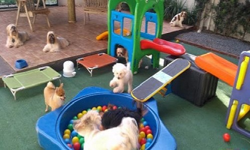
                                

                                

                            

                            

                                
                                

                                

                            

                            

                                
                                

                                

                            

                        

                        <button class="carousel-control-prev" type="button" data-bs-target="#carouselExampleCaptions"
                            data-bs-slide="prev">
                            
                            Previous
                        </button>
                        <button class="carousel-control-next" type="button" data-bs-target="#carouselExampleCaptions"
                            data-bs-slide="next">
                            
                            Next
                        </button>
                    

                

                
               
                <!--

                    

                        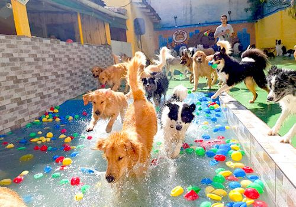
                        

                            <h5 class="card-title">HOTEL</h5>
                            

                                A diária é de 24 horas, onde seu amigo desenvolve diversas atividades como
                                brincadeiras, socialização e cuidados. Ao final do dia são recolhidos
                                para uma área diferente, protegidos do sereno e preparados para dormir. 
                            

                            
<small class="text-muted"></small>

                        

                    

                    

                        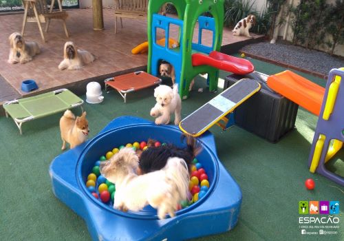
                        

                            <h5 class="card-title">CRECHE</h5>
                            
A nossa creche tem permanência de até 12 horas, sendo das 7hs às 19hs.
                                Temos um rigor bem específico com nossos usuários para evitar algumas intercorrências
                                que são esperadas em nossos pets.

                                Nossa área tem espaço protegido para filhotes em fase de vacinação com cuidados
                                específicos para a idade e auxílio no treinamento para uso de tapete higiênico
                            

                            
<small class="text-muted"></small>

                        

                    

                    

                        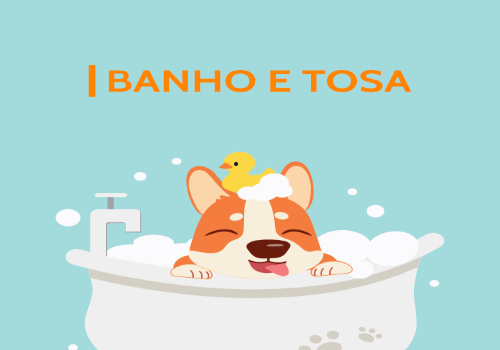
                        

                            <h5 class="card-title">BANHO E TOSA</h5>
                            

                                Os banhos são feitos com o uso de xampus neutro indicados para todos os tipos de pelo e
                                pele inclusive as mais sensíveis. No caso de banhos terapêuticos, basta trazerem os
                                produtos receitados pelo veterinário que realizaremos os procedimentos sem custo
                                adicional.
                            

                            Segunda a sexta: 8:00 às 18:00
                            Sábados: 8:00 às 12:00
                            

                            
<small class="text-muted"></small>

                        

                    

                
 -->

            

             <!--Coluna Direita-->
             

                <ul class="nav nav-pills flex-column mt-3">
                    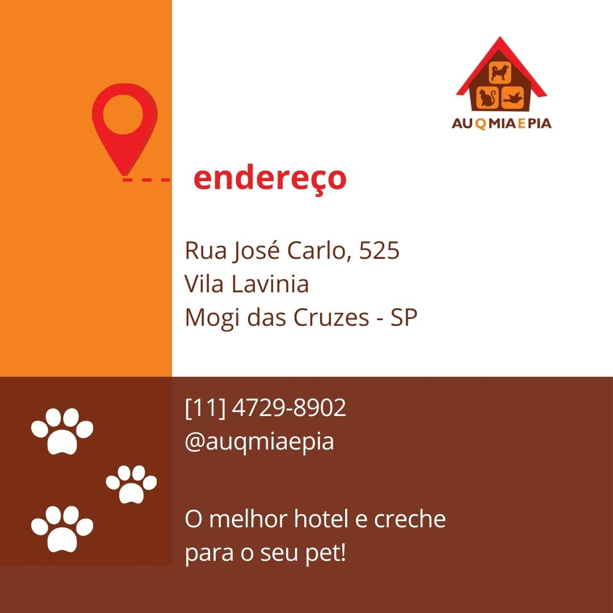
                </ul>
                <h2 class="mt-4"><i>Mapa</i></h2>
                <ul class="nav nav-pills flex-column mt-3">
                </ul>
                <iframe
                    src="https://www.google.com/maps/embed?pb=!1m18!1m12!1m3!1d3657.825427391717!2d-46.21363658447611!3d-23.53878046664505!2m3!1f0!2f0!3f0!3m2!1i1024!2i768!4f13.1!3m3!1m2!1s0x94ce77b84ce4dd37%3A0xf62cc4be93a9a4b!2sCreche%20e%20Hotel%20para%20Cachorros%20%7C%20Au%20Que%20Mia%20e%20Pia%20%7C%20Mogi%20das%20Cruzes!5e0!3m2!1spt-BR!2sbr!4v1652298466164!5m2!1spt-BR!2sbr"
                    width="500" height="450" style="border:0;" allowfullscreen="" loading="lazy"
                    referrerpolicy="no-referrer-when-downgrade"></iframe>
                <ul class="nav nav-pills flex-column mt-2">
                    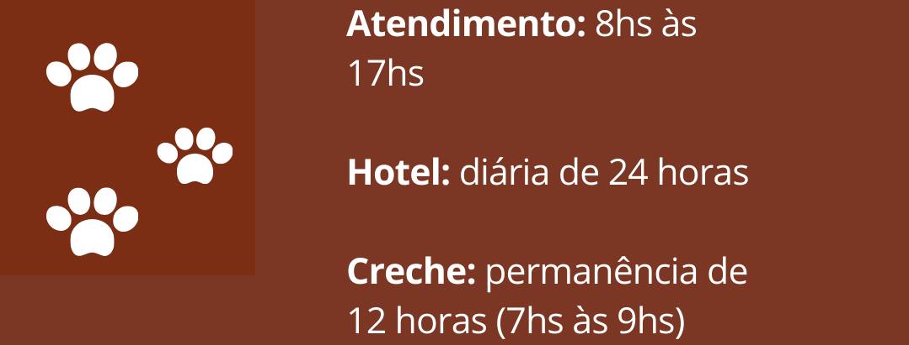
            

        

            

               
                

                  

                    

                        
                      

                        <h5 class="card-title">HOTEL </h5>
                        

                            A diária é de 24 horas, onde seu amigo desenvolve diversas atividades como
                            brincadeiras, socialização e cuidados. Ao final do dia são recolhidos
                            para uma área diferente, protegidos do sereno e preparados para dormir. 
                        

                      

                    

                  

                  

                    

                        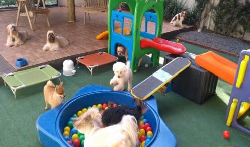
                      

                        <h5 class="card-title">CRECHE</h5>
                        
A nossa creche tem permanência de até 12 horas, sendo das 7hs às 19hs.
                            Nossa área tem espaço protegido para filhotes em fase de vacinação com cuidados
                            específicos para a idade e auxílio no treinamento para uso de tapete higiênico.
                        

                      

                    

                  

                  

                    

                        
                      

                        <h5 class="card-title">BANHO E TOSA</h5>
                        

                            Os banhos são feitos com o uso de xampus neutro indicados para todos os tipos de pelo e
                            pele inclusive as mais sensíveis. No caso de banhos terapêuticos, basta trazerem os
                            produtos receitados pelo veterinário que realizaremos os procedimentos sem custo
                            adicional.
                        

                      

                    

                  

                

              

           
        
    

    <body>

        <!-- Footer -->
        <footer class="mt-5 p-4 bg-navbar text-white text-center">
            
AUQMIAEPIA - Hotel e Creche para Pets-&nbsp;|&nbsp;
                &nbsp;|&nbsp;
                <!-- Link para o whats -->
                &nbsp;|&nbsp;
            

        </footer>
    </body>
    <!--meu Script-->
    
    

</html>
